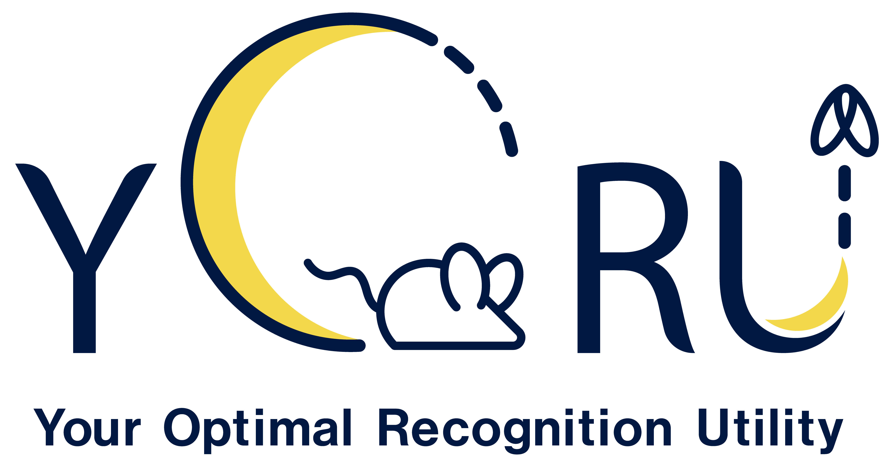

# YORU (Your Optimal Recognition Utility)




“YORU” (Your Optimal Recognition Utility) is an open-source animal behavior recognition system using Python. YORU can detect animal behaviors, not only single-animal behaviors but also social behaviors. YORU also provides online/offline analysis and closed-loop manipulation.


## Features

- Comprehensive Behavior Detection: Recognizes both single-animal and social behaviors, and allows for user-defined animal appearances using deep learning techniques.

- Online/Offline Analysis: Supports real-time and post-experiment data analysis.

- Closed-Loop Manipulation: Enables interactive experiments with live feedback control.

- User-Friendly Interface: Provide the GUI-based software.

- Customizable: Allows you to customize various hardware manipulations in closed-loop system.

# Instructions
For detailed documentation, visit the [YORU Documents](https://kamikouchi-lab.github.io/YORU_doc/)


# Quick install
1. Download or clone the YORU project.
    ```
    cd "Path/to/download"
    git clone https://github.com/Kamikouchi-lab/YORU.git 
    ```

2. Install the GPU driver and [CUDA toolkit](https://developer.nvidia.com/cuda-toolkit).

3. Create a virtual environment using [YORU.yml](YORU.yml) in command prompt or Anaconda prompt.
   
     ```
     conda env create -f "Path/to/YORU.yml"
     ```

4. Activate the virtual environment in the command prompt or Anaconda prompt.

     ```
     conda activate yoru
     ```
    
5. Install [Pytorch](https://pytorch.org) depending on the CUDA versions.

    - For CUDA==12.1

    ```
    pip install torch==2.4.1 torchvision==0.19.1 torchaudio==2.4.1 --index-url https://download.pytorch.org/whl/cu121
    ```

    - (torch, torchvision and torchaudio will be installed.)

6. Run YORU in the command prompt or Anaconda prompt.

    ```
    conda activate yoru
    cd "Peth/to/YORU/project/folder"
    python -m yoru
    ```


# Learn about YORU
- Learn step-by-step: [Tutorial](docs/overview.md)

- Learn by reading: TBA

# Requirements

## OS
- Windows 10 or later

## Hardware
- Memory: 16 GB or more

### Development environments
- OS: Windows 11
- CPU: Intel Core i9 (11th)
- GPU: NVIDIA RTX 3080
- Memory: DDR4 32 GB

# Reference
 - Yamanouchi, H. M., Takeuchi, R. F., Chiba, N., Hashimoto, K., Shimizu, T., Tanaka, R., & Kamikouchi, A. (2024). YORU: social behavior detection based on user-defined animal appearance using deep learning. bioRxiv (p. 2024.11.12.623320). https://doi.org/10.1101/2024.11.12.623320


# License:

AGPL-3.0 License:  YORU is intended for research/academic/personal use only. See the [LICENSE](LICENSE) file for more details.

# Third-Party Libraries and Licenses

This project includes code from the following repositories:

- [LabelImg](https://github.com/HumanSignal/labelImg): Licensed under the MIT License

- [yolov5](https://github.com/ultralytics/yolov5): Licensed under the AGPL-3.0 License
