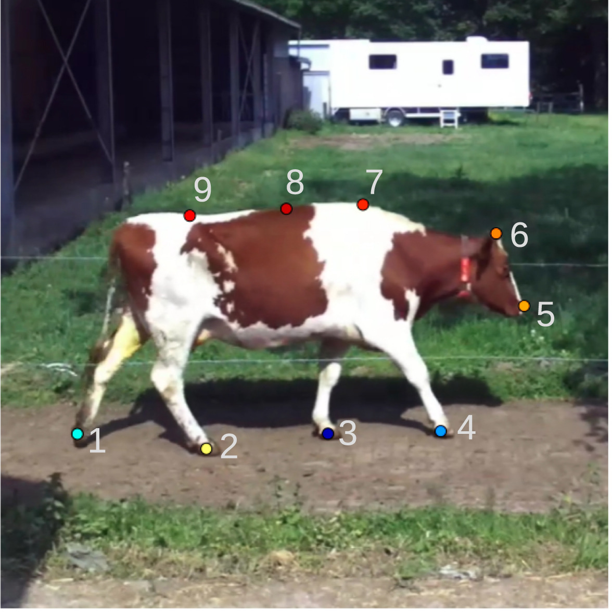

# LamenessDetectionPlayground

A curated playground of open-source projects for video-based animal behaviour analysis and dairy-cow lameness detection. This repository aggregates code and docs from several influential reference implementations so they can be compared, learned from, and extended side-by-side. Contributions that add more relevant projects are warmly welcome.

Note: Each subfolder preserves the original project’s structure and license. Please read and follow the upstream licenses when using any code.

## What’s Inside

- **00 - Russello (2024): Video‑based Lameness Detection**
  
  - Paper: [Video-based automatic lameness detection of dairy cows using pose estimation and multiple locomotion traits - Russello et al. (2024)](https://www.sciencedirect.com/science/article/pii/S0168169924004319)  
  - Source Code: [lameness-detection](https://github.com/hrussel/lameness-detection)
  
- 01-Animal-Behaviour-Inference-Framework_2025 — “Price (Smarter‑Labelme + Behaviour Workflow)”
- 02-behave_2025 — “BEHAVE (Browser‑based Behaviour Coding)”
- 03-YORU_2023 — “YORU (End‑to‑End YOLO/GUI Pipeline)”

  

## Project Overviews

**Russello (2024): Video‑based Lameness Detection**
- Focus: Pose estimation + multiple locomotion traits to automatically detect lameness in dairy cows.
- How it works: Extracts gait keypoints from video, computes locomotion features, and trains classical ML models for lameness classification.
- Try it: Set up the conda env and run training.
  - Env: `00-Cow_lameness_detection_using_pose_estimation_and_multiple_locomotion_traits_2024/environment-short.yml`
  - Entry: `00-Cow_lameness_detection_using_pose_estimation_and_multiple_locomotion_traits_2024/train_ml.py`
- More: See `00-Cow_lameness_detection_using_pose_estimation_and_multiple_locomotion_traits_2024/README.md` (includes citation to Computers and Electronics in Agriculture, 2024).

**Price (2025): Animal Behaviour Inference Framework**
- Focus: A practical workflow built around Smarter‑Labelme to annotate, train animal detectors, and classify behaviours.
- How it works: Three streams — S1 annotate/train detector, S2 label behaviours leveraging the detector, S3 semi‑automate behaviour annotation for rapid iteration.
- Try it: Install Smarter‑Labelme and follow the “howto” workflow.
  - Guide: `01-Animal-Behaviour-Inference-Framework_2025/howto/README.md`
  - Tools: `smarter_labelme` CLI for video→frames, annotation, tracking, dataset prep, and training.

**BEHAVE (2025): Browser‑Based Behaviour Coding**
- Focus: Zero‑install, in‑browser tool to code behaviour from long videos, using AI to skip background‑only sections.
- Highlights: Open‑source (MIT), runs locally in the browser, anonymous usage stats only, programmable ethogram, timestamp/frame extraction, verification viewer.
- Learn more: `02-behave_2025/static/index.md` (includes quick start and app links in the original site structure).

**YORU (2023): End‑to‑End YOLO/GUI Pipeline**

- Focus: A GUI suite for dataset creation, training, evaluation, offline analysis, and real‑time/closed‑loop processing.
- How it works: Project‑oriented pipeline with frame capture, labeling GUIs, training utilities, and real‑time inference.
- Try it: Requires Chrome, Conda, and PyTorch; run the module entry point.
  - Env file: `03-YORU_2023/YORU.yml`
  - Docs: `03-YORU_2023/docs/`
  - Run: `python -m yoru` from the `03-YORU_2023` project folder (after environment setup).

## Suggested Use

- Compare approaches: Review how pose/traits (Russello), annotation+workflow (Price), browser‑first coding (BEHAVE), and GUI/YOLO pipelines (YORU) tackle related problems.
- Reuse components: Borrow data handling, labeling flows, or training scripts as references when building your own pipeline.
- Prototype ideas: Start from the project that best matches your constraints (browser‑based, GUI, or script‑first) and iterate.

## Contributing

- Add references: PRs adding other relevant projects, datasets, or tutorials are welcome.
- Keep it tidy: Include a short description, upstream link, license, and a minimal “try it” note for each addition.
- Be respectful: Do not remove or alter upstream licenses; link to the original authors and papers when available.

## Attribution & Licenses

- All subprojects are credited to their original authors and keep their original licenses within their folders.
- If you use a specific subproject, please cite and follow its license and citation instructions.

## System Notes

- GPU recommended: Training and inference workflows in several subprojects benefit from NVIDIA GPUs and CUDA.
- Large data: Example datasets or media may be partial; follow each subproject’s README for data expectations.
