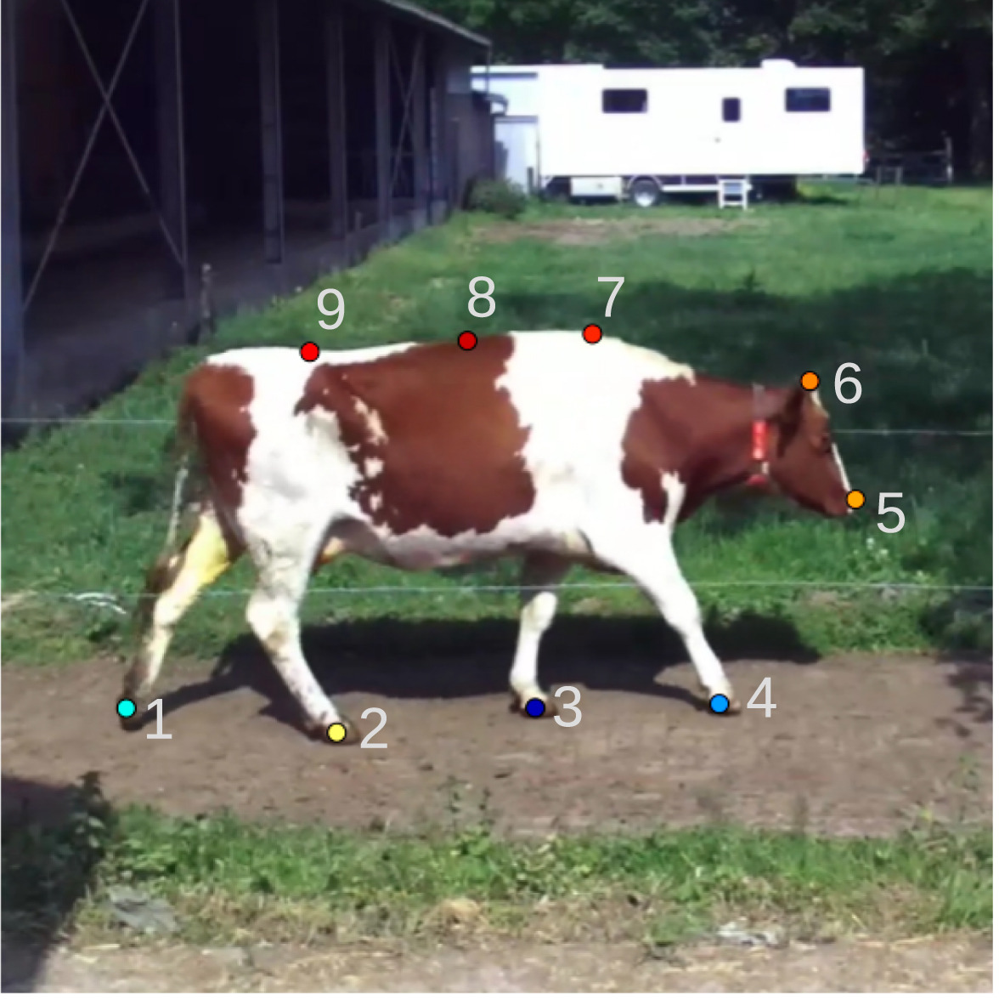
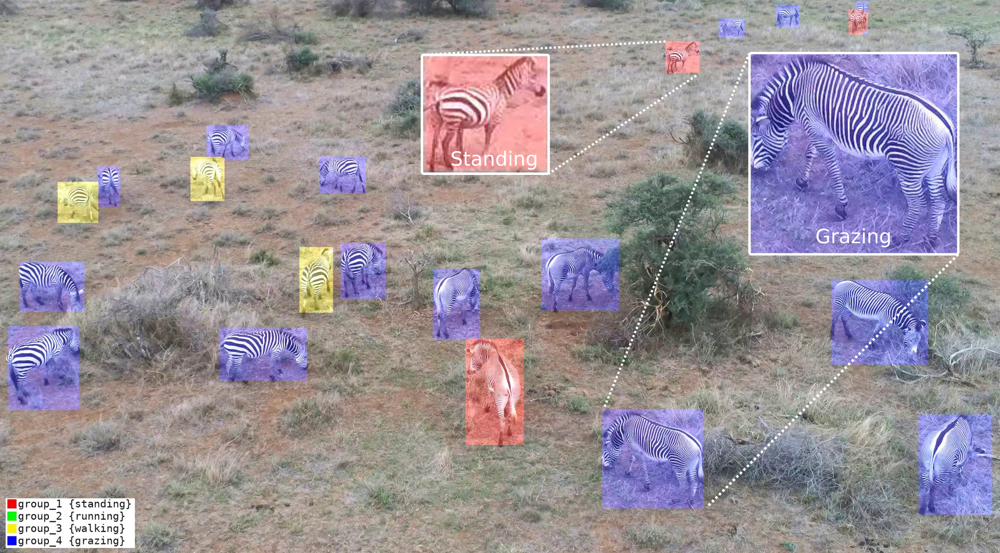
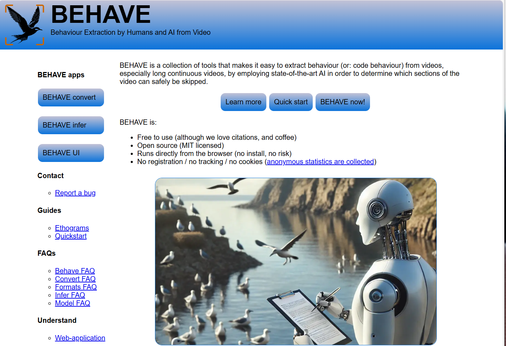

**Important: Attribution & Licenses**
- All subprojects are credited to their original authors and keep their original licenses within their folders.
- If you use a specific subproject, please cite and follow its license and citation instructions.

# LamenessDetectionPlayground

A playground of open-source projects that relate to video-based animal behaviour analysis. This repository aggregates code and docs from several interesting reference implementations so they can be compared, learned from, and extended side-by-side. Contributions that add more relevant projects are warmly welcome.

## What’s Inside

- **00 - Russello (2024): Video‑based Lameness Detection**
  

    
  

  - Paper: [Video-based automatic lameness detection of dairy cows using pose estimation and multiple locomotion traits - Russello et al. (2024)](https://www.sciencedirect.com/science/article/pii/S0168169924004319)  
  - Source Code: [github](https://github.com/hrussel/lameness-detection)
  - Focus: Pose estimation + multiple locomotion traits to detect lameness in dairy cows automatically.
  - How it works: Extracts gait keypoints from video, computes locomotion features, and trains classical ML models for lameness classification.
  - Promised **normal vs. lame** classification accuracy: 80.1%(6 locomotion traits)
  - Performance on AWP datasets: to be tested.
  
- **01 - Price (2025): Animal Behaviour Inference Framework (Smarter‑Labelme + Behaviour Workflow)**
  

    
  

  - Paper: [A framework for fast, large-scale, semi-automatic inference of animal behaviour from monocular videos - Price et al. (2025)](https://besjournals.onlinelibrary.wiley.com/doi/full/10.1111/2041-210X.70124)  
  - Source Code: [github](https://github.com/robot-perception-group/Animal-Behaviour-Inference-Framework) / [zenodo](https://zenodo.org/records/15834944)
  - Datasets: [darus](https://darus.uni-stuttgart.de/dataset.xhtml?persistentId=doi:10.18419/DARUS-5162) / [keeper](https://keeper.mpdl.mpg.de/d/a9822e000aff4b5391e1/)
  - Focus: A practical workflow built around Smarter‑Labelme to annotate, train animal detectors, and classify behaviours.
  - How it works: Three streams — S1 annotate/train detector, S2 label behaviours leveraging the detector, S3 semi‑automate behaviour annotation for rapid iteration.
  - Promised **animal behavior** labeling accuracy:  ~81%
  - Promised **animal behavior** labeling speed: 0.1 s per frame(fast GPU); 1–2 s per frame(without GPU)
  - Performance on AWP datasets: to be tested.

- **02 - Elhorst (2025): Browser‑Based Behaviour Coding**
  

    
  

  - Paper: [BEHAVE - facilitating behaviour coding from videos with AI-detected animals - Elhorst et al. (2025)](https://www.sciencedirect.com/science/article/pii/S1574954125001153) 
  - Source Code: [github](https://github.com/behave-app/behave) 
  - Website application address: [behave.claude-apps.com](https://behave.claude-apps.com/)
  - Focus: Zero‑install, in‑browser tool to code behaviour from long videos, using AI to skip background‑only sections.
  - Highlights: Open‑source (MIT), runs locally in the browser, anonymous usage stats only, programmable ethogram, timestamp/frame extraction, verification viewer.
- **03-Kamikouchi (2023): End‑to‑End YOLO/GUI Pipeline”**

  

    
  

  - Paper: [YORU: social behavior detection based on user-defined animal appearance using deep learning - Kamikouchi et al. (2024)](https://www.biorxiv.org/content/10.1101/2024.11.12.623320v1.full)  
  - Source Code: [github](https://github.com/Kamikouchi-lab/YORU)
  - Focus: A GUI suite for dataset creation, training, evaluation, offline analysis, and real‑time/closed‑loop processing.
  - How it works: Project‑oriented pipeline with frame capture, labeling GUIs, training utilities, and real‑time inference.
  - Promised **animal behavior** classification accuracy: >90%
  - Promised labeling speed: ~5ms per frame(RTX4080 + YOLOv5s)
  - Performance on AWP datasets: to be tested

- **04- TBA** (Feel free to add any other fun and relevant projects or references here!)

